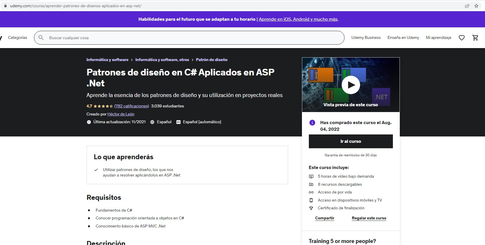
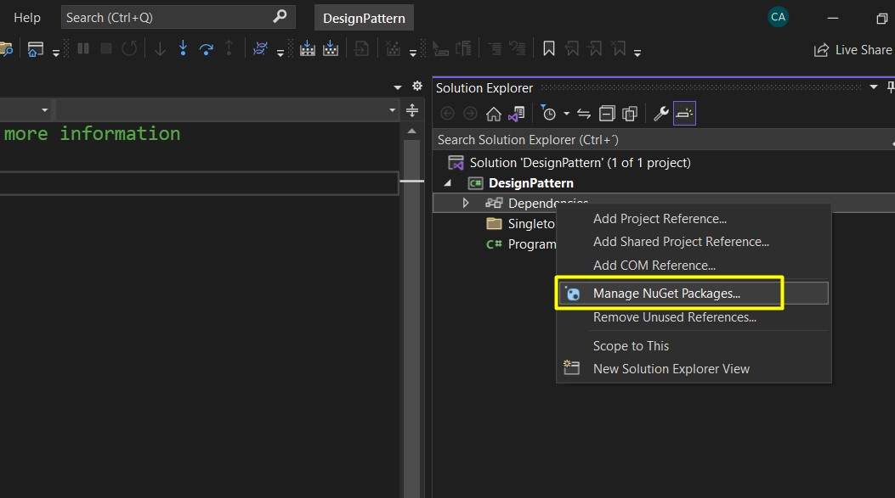
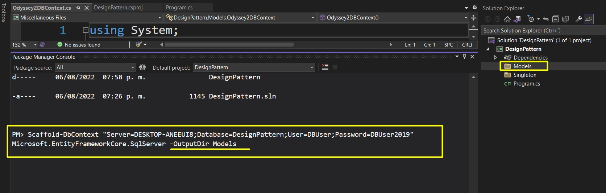
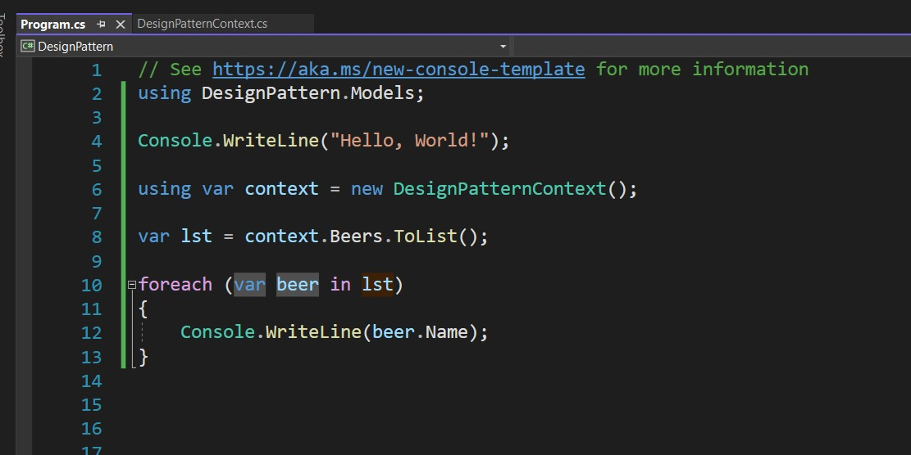

# udy-patronesdiseno-console

Aplicacion de consola realizadas por el curso Patrones de diseño en C# Aplicados en ASP .Net

https://www.udemy.com/course/aprender-patrones-de-disenos-aplicados-en-asp-net/




# Seccion 6: Repository

## 11. Entity Framework

Aqui vamos a hacer uso de ORM de Entity Framework, y el ORM
es basicamente el Mapeo de una base de datos para que puedas
utilizarla con programacion orientada a Objetos.

- Ahora vamos a crear una la siguiente base de
datos

```sql
CREATE DATABASE DesignPattern;
USE DesignPattern;


CREATE TABLE Beer
(
    Pk int IDENTITY (1, 1) not null,
    CONSTRAINT Pk_Beer PRIMARY KEY (Pk),
    
    Name NVARCHAR(50) NOT NULL,
    Style NVARCHAR(50) NOT NULL
);
GO

insert into Beer (Name, Style) values ('Corona', 'Blanca')
insert into Beer (Name, Style) values ('Minerva', 'Negra')

```

- Vamos a agregar Paquetes Nuggets


Instalamos los siguientes paquetes

    - > Microsoft.EntityFrameworkCore.SqlServer
    - > Microsoft.EntityFrameworkCore.Tools

Ahora abrimos una consola de Paqutetes Nugget y ejecutamos el
siguiente comando

`Scaffold-DbContext "Server=DESKTOP-ANEEUI8;Database=DesignPattern;User=DBUser;Password=DBUser2019" Microsoft.EntityFrameworkCore.SqlServer -OutputDir Models`




Agregamos el codigo y corremos




