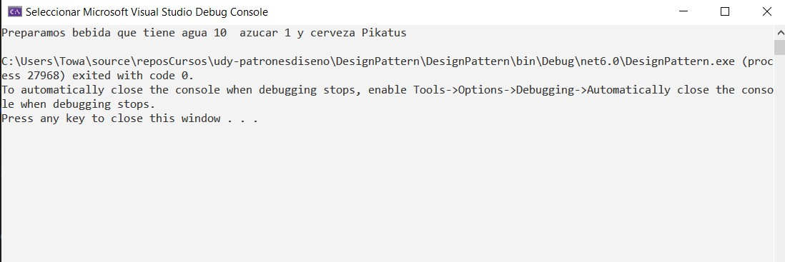
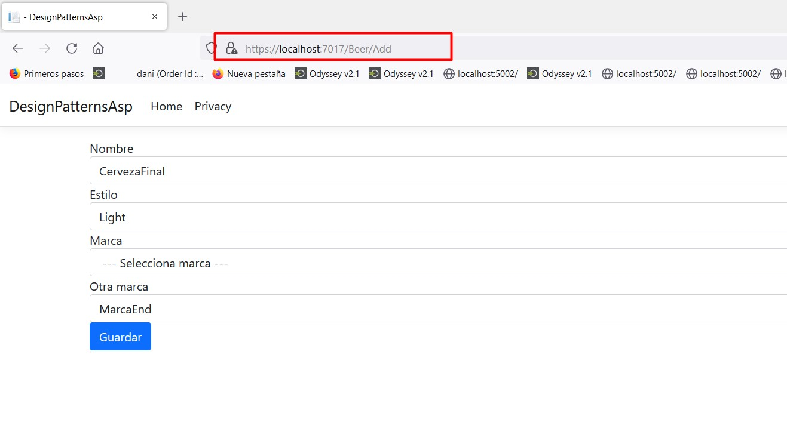

# udy-patronesdiseno-console

Aplicacion de consola realizadas por el curso Patrones de diseño en C# Aplicados en ASP .Net

https://www.udemy.com/course/aprender-patrones-de-disenos-aplicados-en-asp-net/


## Preparando el Ambiente
- Creamos un proyecto de **consola**
- Creamos un proyecto en la misma solucion de **ASP.NET Core Web 
App (Model-View-Controller)**
- Creamos proyecto en la misma solucion de **Library Class**

Namas como introduccion. 

* Un controlador es el que recibe la solicitu de un cliente, 
la trata, la maneja junto con el modelo y si es necesario 
regresar una vista siendo la vista contenido HTML, va
a regresar una vista.

* Y la herramienta de biblioteca nos sirve para tener mis
herramientas separadas y pueda utilizarla en otros proyectos 
sin tener que volverlos a programar.

# Seccion 3 Singleton

## Video 5 Explicacion

Este patron nos va a servir para crear objetos, y aseguraremos que si o si solo se cree un objeto y esto puede ser por performance, 
algun tercero que requiere que solo haya una unica instancia.


Program


Despues de la corrida


## Video 6 Implementacion en Asp

Un controlador es el que recibe la solicitud de un cliente la 
trata, la maneja junto con el modelo, y si es adecuado regresar 
una vista siendo la vista contenido HTML, te regresa la vista.

> Nota. sealed ("Sellado") de `public sealed class Log` decimos
que la clase Log no se va a poder heredar.

Creamos el proyecto Tools en donde alojamos la clase Singleton
de Log y ademas agregamos referencias a nuestro proyecto 
de aspnet 


> * **Implementacion 1**


Corrida 


> * **Implementacion 2**

Agregamos configuracion de Path en appsettings.


Agregamos una clase que va a ser como la representacion de
lo que agregamos en MyConfig


Hacemos una Inyeccion de dependencia de MyConfiguracin en
Programa para versiones Net 6 y para Net 5 Inferior en Startup.


Recibimos lo que se inyecto en el controlador


Hacemos uso de la variable que recibe la inyeccion


> **Nota** De esta manera si en un futuro decidimos guardar en
otra ruta los Logs, lo podremos cambiar facilmente.

Ahora si nosotros estamos trabajando con hilos podemos hacer un 
truco ya que podria suceder que dos hilos entren en el mismo 
instante y por lo cual van a crear 2 instancias diferentes
pero se tendra al final la ultima creada lo cual no es correcto.

> Hay una propiedad en .Net que se llama `lock` que lo que
va a hacer es que mientras esta un hilo trabajando con este
atributo no puede trabajar otro hilo, entonces con la siguiente
instruccion o truco, decimos que nos proteja la variable 
`_protect` y mientras se esta protegindo el otro hilo va a estar
en espera y de esta manera estamos protegiendolo para cuando 
estamos trabajando con hilos.


# Seccion 4: Factory Method
## Video 7 Explicacion

Imagina que tienes una fabrica, esta fabrica hace productos,
estos productos pueden ser de distinto tipo, entonces tu puedes
tener un conjunto de fabricas.

Ahora bien, factory method es una fabrica creadora de objetos.


La practica nos indica que debemos de tener una clase abstracta
llamada **creator**(creador) y vamos a tener clases que hereden de
Creator llamada **ConcreteCreator**(creadores concretos) y
estas van a ser la fabricas que van a crear productos.

Ahora vamos a tener una interfaz llamada Product(Producto) que
va a ser la que va a categorizar a los productos que vamos a
crear, por ejemplo, podemos tener una fabrica que cree productos, 
por ejemplo un producto en una tienda ya sea papitas, cerveza, 
etc, pero tambien un producto podria ser un Kit de productos, 
un combo de productos, una promocion, al fina de todo va 
a tener una iteracion de ser una venta.

Ahora, tu puedes crear una fabrica para crear productos, para 
crear clases, para crear objetos de clases que van a implementar
la interfaz producto. 

Que ventajas tenemos?

Tenemos que la responsabilidad de crear va a estar en la fabrica, 
es decir, si tu estos objetos los utilizas en muchisimos lados, 
tu vas a tener la responsabilidad solamente en un lado  para 
crear el objeto. 

Tu Objeto podria tener muchisimos parametros para su creacion
y esos parametros de su creacion tu no vas a tener la 
responsabilidad mas que un solo lado .

Otras de las ventajas es que podemos tener objetos que son muy
parecidos, los cuales vamos a categorizar con una interfaz
**product** y si necesitamos crear otro objeto que es parecido, 
podemos tener esta misma jeraquizacion sin tener que reinventar
la rueda para crear este nuevo producto que a lo mejor tiene
otros atributos o metodos.

Y este es otra de las ventajas, la flexibilidad que te da para
no recrear la rueda.

### Codigo implementacion


## Video 8 Implementacion en ASP

En este proyecto lo que vamos a hacer es manejas las 
ganancias sobre algo que pueden tener muchas reglas que 
pueden ser engorrosas, y estas reglas a veses tienen distintos
factores de entrada.
Por ejemplo, tu puedes vender algo, y este algo puede tener 
ciertas ganancias porque es local, es decir no estas 
vendiendo al publico extranjero, ahora este mismo algo
lo puedes vender al publico extranjero y entonces tendrias
otro conjunto de reglas que van a alterar la ganancia.

La ganancias de un producto seria eso que tu estas ganando extra
a lo que te costo el producto.

**Factory method ayuda** bastante cuando tu no sabes aun cuales 
son esos factores externos, a veses estas apenas programando
y el cliente se le ocurre agregar nuevos factores.

Estos factores son elementos que sirber para construir el objeto.

Entonces las ganancias pueden ser representadas como un objeto, 
el cual va a tener un metodo que va a calcular la ganancia
dependiendo si es un producto en venta local, o publico
extranjero y de repente podra tener otro, por ejemplo, 
venta por internet, etc. entonces aqui vamos a representar 
este tipo de ganancias.

Hay 2 cuestiones que debemos de tener muy en claro en 
**Factory Method**, hay 2 instancias generales
* Una Fabrica o Creador 
* Y un producto a Crear.

Ademas que tenemos 2 interfaces que nos sirven solamente para
dar orden
* Una que nos va a servir para dar una orden de los productos
creados 

* Y otra para categorizar la fabrica de sus productos.

### Ahora vamos al Codigo.

Creamos la carpeta earn y ahi es donde vamos a poner toda
la logistica de nuestras fabricas ya que vamos a tener
varias fabricas.
Y las fabricas van a representar la creacion de un
objeto y en este caso este objeto va a tener la funcionalidad
de calcular las ganancias.

> * Agregamos la interfaz IEarn


> * Creamos la clase Local Earn con implementacion de IEarn


> * Creamos EarnFactory o fabrica


> * Creamos la categoria de Fabrica que es LocalEarnFactory


> * Agregamos controlador ProductDetails y la vista a nuestro nuevo controlador


> * Hacemos instancia de la fabrica y creamos nuestro objeto
ganancia local.


> * Agregamos codigo a nuestra vista


> * Corrida 1


**Pero despues llega mi cliente y dise que quiere tener otras reglas para
un total de publico extranjero y pues entonces factory method
siempre se va a acoplar cuando falten requerimientos.**

> * Agregamos ForeingEarn


> * Agregamos ForeingFactory


> * Instanciamos la fabrica y creamos el objeto en el Controller


> * Agregamos codigo a la vista


> * Corrida 2


Entonces cuando hay un nuevo requerimiento o cambia un 
requirimiento, factory method te permite crecer de manera
lineal si afectar a otras funcionalidades y esta es la magia.

> **NOTA** Factory method tiene otra representacion que es como
un swich case, pero en este caso esta representacion es 
la que nos gusta mas ya que es mas flexible y ademas es mejor
deacuerdo a la experiencia, solo es como nota ya que
existen diferentes implementaciones de Factory Method. 

# Seccion 5: Dependency Injection

Inyeccion de dependencia es uno de los mas utilizados, y
de echo si estas utilizando Frameworks de los mas 
modernos, estaremos seguros que estamos utilizando 
inyeccion de dependencia.

La inyeccion de dependencia trata sobre quitar la 
responsabilidad de una clase de crear objetos a partir de
otras clases, es decir, estas clases no tienen porque saber
como crear ciertos objetos, pueden tener objetos hijos, 
pero no tienen que saber como crearlos, lo que tienen que hacer
es que tu tengas que inyectarle el objeto una ves creado.

Es bien sencillo, como ejemplo, tu eres una persona que le gusta
la cerveza, pero tu no sabes como se hace la cerveza, 
simplemente te la dan ya echa, esto es la inyeccion de
dependencia, si usted quiere tomar cerveza, no tiene
que saber como se hace una cerveza y simplemente ya te lo dan
creado, esto es un ejemplo practico de inyeccion de 
dependencia en la vida real, ya que hay objetos
que tienen otros objetos, pero no tendriamos que
tener la responsabilidad internamente en nuestra clase
de crearlos, si no que los vamos a inyectar.

Las maneras de inyectarlo pueden ser en un metodo o en su
constructor, regularmente en los proyectos de .Net o 
ASP la inyeccion va a ser en el contructor de los 
controladores.

Ahora vamos a ver un ejemplo de porque es importante la inyeccion 
de dependencia

> **La inyeccion de dependencia vienen a resolver
unos de los principios Solid, que es el principio de 
la inversion de la independecia y es practicamente que
no se debe depender de implementaciones pero si de abstraccion,
es decir, tu clase no deberia de depender de como crear las cosas
y simplemente recibir las cosas ya hechas**


> * 


> * 

> * 

> * 


# Seccion 6: Repository

## 11. Entity Framework

Aqui vamos a hacer uso de ORM de Entity Framework, y el ORM
es basicamente el Mapeo de una base de datos para que puedas
utilizarla con programacion orientada a Objetos.

- Ahora vamos a crear una la siguiente base de
datos

```sql
CREATE DATABASE DesignPattern;
USE DesignPattern;


CREATE TABLE Beer
(
    Pk int IDENTITY (1, 1) not null,
    CONSTRAINT Pk_Beer PRIMARY KEY (Pk),
    
    Name NVARCHAR(50) NOT NULL,
    Style NVARCHAR(50) NOT NULL
);
GO

insert into Beer (Name, Style) values ('Corona', 'Blanca')
insert into Beer (Name, Style) values ('Minerva', 'Negra')

```

- Vamos a agregar Paquetes Nuggets


Instalamos los siguientes paquetes

    - > Microsoft.EntityFrameworkCore.SqlServer
    - > Microsoft.EntityFrameworkCore.Tools

Ahora abrimos una consola de Paqutetes Nugget y ejecutamos el
siguiente comando

`Scaffold-DbContext "Server=DESKTOP-ANEEUI8;Database=DesignPattern;User=DBUser;Password=DBUser2019" Microsoft.EntityFrameworkCore.SqlServer -OutputDir Models`


Agregamos el codigo y corremos


## 12 Explicacion 

Imaginemos que tenemos que tenemos diferentes fuentes de datos
tal como Dapper, EntityFramework o un Api, entonces el 
patro repository es un intermediario para esta informacion.

Lo que hace el patron Repository es darte una manera de que 
accedas a esos datos sin que la aplicacion se preocupe de que 
es lo que esta pasando en repository, y este es un 
patron de diseño escructural.

Y esto es con la finalidad de que la aplicacion no tiene que 
enterarse si cuando vas por la tabla usuario vas a un API o 
cuando vas por cerveza vas a entity framework, entonces 
por lo tanto para la aplicacion tiene que ser invisible, 
entonces lo unico que debe de hacer la aplicacion es invocar
un metodo sin importarle que es lo que esta pasando por detras.


### Por ahorita vamos a hacer una implementacion sencilla y despues la volvermos mas compleja.

- Agregamos la interface con los contratos dados y la clase repository


Hacemos uso del repositorio y corremos la aplicacion


## 13 Repository con Generics

Ahora agregaos una nueva tabla 

```sql

USE DesignPattern;

CREATE TABLE Brand
(
    Pk int IDENTITY (1, 1) not null,
    CONSTRAINT Pk_Brand PRIMARY KEY (Pk),
    
    Name NVARCHAR(50) NOT NULL,
);
GO
```

Ahora vamos a generar nuestro modelo a traves de scafold abriendo
una consola de nugget y tecleando el siguiente comando

> `Scaffold-DbContext "Server=DESKTOP-ANEEUI8;Database=DesignPattern;User=DBUser;Password=DBUser2019" Microsoft.EntityFrameworkCore.SqlServer -OutputDir Models -force`

Nota. Aqui al final agregamos **force** para que me agregue la 
el nuevo modelo de la nueva tabla.

Generic en este caso lo vamos a utilizar para que una clase se 
comporte igual para distintos fuentes de modelo.

Entonces las ventajas de utilizar un repositorio Generico es que
para cada nueva tabla no vamos a crear nueva interfaz, 
si no que con la clase generica nos ahorramos todo eso.


Nota. Vamos a utilizar el potencial de DbSet ya que esto te 
permite convertir esas tablas en clases para poder trabajar
con programacion orientada a objetos. DbSet

- Creamos nuestra clase Repository


- Agregamos codigo de corrida 


- Corrida


## Video 14 Implementacion en ASP

Creamos proyecto de bibliotecas de clases en la misma solucion y
eliminamos la clase por defecto que crea.


> - DesignPatterns.Models

Agregamos las dependecias nugget a la biblioteca de Clases

Instalamos los siguientes paquetes

    - > Microsoft.EntityFrameworkCore.SqlServer
    - > Microsoft.EntityFrameworkCore.Tools


Creamos proyectos de bibliotecas de clases en la misma solucion y
eliminamos la clase por defecto que crea.

> - DesignPatterns.Repository

Ahora vamos a establecer el Startup Project al **DesignPatterns.Models**

> **NOTA** Esto es importante ya que de lo contrario no podemos
hacer scafold


Ahora abrimos una consola de Paqutetes Nugget y ejecutamos el
siguiente comando 

> **Asegurarnos que estamos en el proyecto DesignPatterns.Models**

`Scaffold-DbContext "Server=DESKTOP-ANEEUI8;Database=DesignPattern;User=DBUser;Password=DBUser2019" Microsoft.EntityFrameworkCore.SqlServer -OutputDir Data`


Ahora vamos al proyecto de DesignPatterns.Repository y agregamos
referencias de proyecto de **DesignPatterns.Models**


Ahora en el proyecto DesignPatterns.Repository vamos a agregar 
la interfaz **IRepository** y la clase **Repository** 
y despues vamos a copiar el codigo que habiamos echo en el 
video anterior.


Ahora lo que necesitamos es ver como implementarlo en el 
proyecto de DesignPatternsAsp

Agregamos las dependecias de proyecto a el proyecto de 
DesignPatternsAsp


Ahora vamos a ir a Startup(Version .Net 5  o inferior) o a
Program.vs (caso de .Net 6 pero tambien podemos crear el 
Startup.cs y personalizarlo)

A continuacion vamos a ver los alcances de las inyecciones
de dependencia en .Net Core

* **services.AddScoped** .- Es a nivel de solicitud, es decir 
va a ser objetos diferentes por solicitud.

* **services.AddTransient** .- Solo es recomendable en funciones, 
es decir cuando se procesa algo y la funcion devuelve algo.

* **services.AddSingleton** .-  Se crean la primera vez que se solicitan (o cuando se ejecuta ConfigureServices si especifica una instancia allí) y luego cada solicitud posterior utilizará la misma instancia.

y para eso necesitamos agregar la cadena de coneccion al 
appsetting.json para despues hacer una inyeccion de 
dependencia.


Agrego la inyeccion de dependecia en Program.cs ya que estamos
en .Net 6


Agregamos codigo al contexto para devolver las beers.


Nos vamos a la vista para agregar codigo y probar.


# Seccion 7 UnitOfWork

## Video 15 Explicacion

Es una forma para trabajarse en conjunto.
Por ejemplo

En la siguiente imagen vemos que hay 2 save(), y eso representa
que se van a hacer 2 conecciones a la base de datos.


Entonces lo que nos propone el patron UnitOfWork es que 
si tenemos un conjunto de peticiones a la base de datos, podemos 
agruparlas y mandarlas juntas.

Entonces por lo tanto este es un extra al patron repository.


UnitOfWork tambien tiene un comportamiento similar a singleton, 
es decir, si el objeto ha sido solicitado en un esquema de 
trabajo, es decir se crea el objeto, pero si alguien vuelve
a solicitar ese objeto, entonces te devuelvo el objeto
que ya habia creado sin necesida de tener que recrearlo.

Lo que hacemos con UnitOfwork es agrupar los repositorios
en una parte, en un grupo y ese grupo va a trabajar como uno
cuando se trabaje con la solicitud de la DB.

La razon de esto, es que se tienen que aislar estas partes, 
porque no todos los programadores trabajan en el mismo proyecto, 
si no que a lo mejor la capa de modelo lo trabajan otro
grupo de programadores, y la capa de negocio la trabaja
otro grupo de programadores, y es por eso que las capas
deber ser invisibles ya que ninguna capa tiene que saber
de como esta escructurado y los detalles de la otra capa.


Vamos a program y guardamos 2 elementos diferentes


## Video 16 Implementacion en ASP

Creamos la siguiente DB

```sql
DROP database DesignPattern;

CREATE DATABASE DesignPattern;
USE DesignPattern;


CREATE TABLE Brand
(
    Pk int IDENTITY (1, 1) not null,
    CONSTRAINT Pk_Brand PRIMARY KEY (Pk),
    
    Name NVARCHAR(50) NOT NULL,
);
GO

CREATE TABLE Beer
(
    Pk int IDENTITY (1, 1) not null,
    CONSTRAINT Pk_Beer PRIMARY KEY (Pk),
    
    Name NVARCHAR(50) NOT NULL,
    Style NVARCHAR(50) NOT NULL,

    PkBrand int null,
    CONSTRAINT FK_Beer_Brand_PkBrand FOREIGN KEY (PkBrand) REFERENCES Brand (Pk)
    
);
GO

INSERT into brand (Name) values ('cesBrand');
insert into beer values ('Corona', 'Style1',1)

```

Nos ubicamos en el proyecto de DesignPatterns.Models y ejecutamos
`Scaffold-DbContext "Server=DESKTOP-ANEEUI8;Database=DesignPattern;User=DBUser;Password=DBUser2019" Microsoft.EntityFrameworkCore.SqlServer -OutputDir Data`

para actualizar nuestros modelos.

Ahora vamos a crear nuestra interface y clase de UnitOfWork
en nuestro proyecto DesignPatterns.Repository y el codigo 
tiene que ser identico que lo que icimos en la seccion anterior.


Ahora lo que vamos a hacer es inyectar la Interfaz
IUnitOfWork


Ahora agregamos el controlador


Agregamos el modelo y el codigo en el controlador


Agregamos una vista vacia al index


Agregamos el siguiente codigo a la vista.


Corremos la applicacion 


# Video 17 Guardando en 2 tablas

Imaginemos que tenemos que agregar una cerveza, pero 
esa cerceza podria ser de una nueva marca que no tenemos
en nuestra base de datos, entonces el problema radica
que tenemos que ir a las 2 tablas.

El patron UnitOfWork nos va ayudar con este tema.

A continuacion vamos a agregar un nuevo ViewModel clase con 
el nombre `FormBeerViewModel` con se muestra en la siguiente 
imagen


Despues vamos a BeerController y agregamos 2 metodos


Ahora vamos a agregar una vista vacia al primer metodo Add de tipo
[Get] que habiamos agregado


Y agregamos el siguiente codigo.
```html
@model DesignPatternsAsp.Models.ViewModels.FormBeerViewModel

<form asp-controller="Beer" asp-action="Add" method="post">
    <div class="form-group">
        <label asp-for="Name"></label>
        <input class="form-control" asp-for="Name"/>
        <span asp-validation-for="Name" class="text-danger"></span>        
    </div>

    <div class="form-group">
        <label asp-for="Style"></label>
        <input class="form-control" asp-for="Style"/>
        <span asp-validation-for="Style" class="text-danger"></span>        
    </div>

    <div class="form-group">
        <label asp-for="BrandId"></label>
        <select class="form-control" asp-for="BrandId" asp-items="@ViewBag.Brands">
            <option value="">--- Selecciona marca ---</option>
        </select>
        <span asp-validation-for="BrandId" class="text-danger"></span>        
    </div>

    <div class="form-group">
        <label asp-for="OtherBrand"></label>
        <input class="form-control" asp-for="OtherBrand"/>
        <span asp-validation-for="OtherBrand" class="text-danger"></span>        
    </div>


    <div class="form-group">
        <button class="btn btn-primary" type="submit">Guardar</button>
    </div>
</form>


```

Un punto a recordar en .Net 6


Corridas




